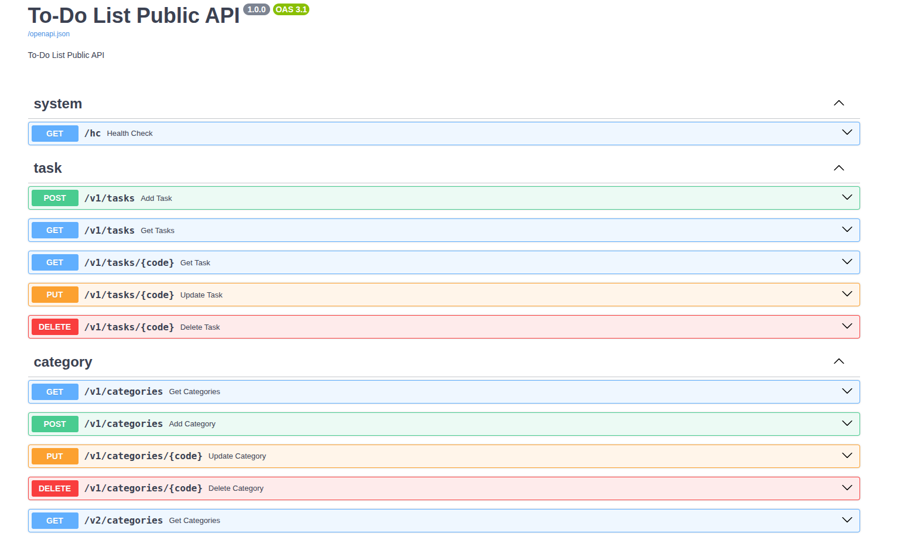

# ToDoList API

[](https://github.com/Muhammed-Mndour/bolierplate)
[]()

A clean, production-minded FastAPI **ToDoList**  implementing categories, tasks, priorities and statuses with a small, testable architecture.



---

## Table of contents

* [Project overview](#project-overview)
* [Features](#features)
* [Architecture & repo layout](#architecture--repo-layout)
* [APIs (quick reference)](#apis-quick-reference)
* [Testing & quality](#testing--quality)
* [Examples (curl)](#examples-curl)
* [What I learned](#what-i-learned)


---

## Project overview

This repository contains a small but realistic FastAPI-based ToDoList Application . It focuses on clear separation of concerns, testability and developer ergonomics:

* **API layer** (versioned v1/v2)
* **Domain & data layers** (business logic + DB entities)
* **Clear request context** (header-driven `X-User-Code` to identify users)
* Docker compose and dev tooling for easy local setup

## Features

* Create / read / update / delete categories and tasks
* Versioned API endpoints (v1 stable, v2 experimental)
* Priorities & statuses as first-class objects
* Unit tests and CI-friendly scripts
* Clean separation: `apptodolist` (API) + `libtodolist` (domain + data) + `libutil`

## Architecture & repo layout

Top-level tree (reduced):

```
├── bin
├── compose
├── dev-env
├── docker-compose.yml
├── Dockerfile
├── docs
├── pyproject.toml
├── README.md
├── src
│  ├── apptodolist          # API layer (FastAPI)
│  └── libtodolist          # domain, data, messages, entities
└── tests
```

`apptodolist` contains: `app.py`, `middleware.py`, `views/` (v1 and v2 routers), `dependencies.py` for extracting `X-User-Code` into a `RequestContext`.

`libtodolist` contains: `data/entities` (DB operations), `domain` (business logic), and `messages` (DTOs).

## APIs (quick reference)

**Header**: every request must include `X-User-Code: <string>`

### Categories

* `GET /v1/categories` — list active categories for authenticated user
* `POST /v1/categories` — add category (`{ "label": "Work" }`) (alphanumeric label)
* `PUT /v1/categories/{code}` — update category
* `DELETE /v1/categories/{code}` — delete category

Example response lists and error shapes are implemented consistently as `{ success, code, message, data }`.

### Tasks

* `POST /v1/tasks` — create task. Required: `title`. Optional: `description`, `priority_code`, `status_code`, `category_code`, `due_date`.
* `GET /v1/tasks` — list tasks. Optional `?category_code=...`
* `GET /v1/task?task_code=...` — get a single task
* `PUT /v1/tasks/{code}` — update
* `DELETE /v1/tasks/{code}` — delete

Response and error examples follow the same uniform envelope used by categories.

## Running tests & static checks

* Tests: `pytest -q`
* Format: `./bin/pyformat.sh`
* Lint/type: `./bin/pycheck.sh` (configurable in `pyproject.toml`)

The project includes unit tests under `tests/todolist` and pytest fixtures for DB isolation.

## Examples (curl)

Add category:

```bash
curl -X POST "http://localhost:8000/v1/categories" \
  -H "Content-Type: application/json" \
  -H "X-User-Code: U1234" \
  -d '{"label":"Work"}'
```

Create task:

```bash
curl -X POST "http://localhost:8000/v1/tasks" \
  -H "Content-Type: application/json" \
  -H "X-User-Code: U1234" \
  -d '{
    "title":"Home work",
    "description":"Home work",
    "priority_code":"P0001",
    "status_code":"S4589045",
    "category_code":"C1752504942590",
    "due_date":"2025-07-23"
  }'
```

Errors are returned with `success: false` and a helpful `message` field (e.g. `"label must be alphanumeric"`).

## What I learned

A short, clean list you can reuse in job applications or personal notes:

* Unit testing fundamentals (pytest fixtures and isolated tests)
* Difference between *web page*, *website*, *web server*, and *search engine*
* Lifecycle of an HTTP network request (client → server → response)
* What is WSGI and why it is an interface (swap web servers without changing your app)
* ASGI basics (async-capable Python server interface)
* API versioning patterns and why they matter
* FastAPI middleware and dependency injection patterns
* CORS and `Origin` header handling
* HTTP headers and their importance in request context
* Pydantic & `mypy` usage for DTOs and typing
* FastAPI dependencies including class-based and yield-style dependencies
* Session & engine patterns for DB access and transaction management
* Writing a reusable Session wrapper (see `libutil/db_session.py`)
* Positional args, `*args` and `**kwargs` in Python

